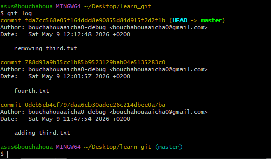
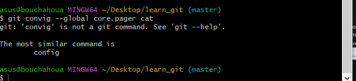

1.Create a folder called learn_git.

2.Cd (change directory) into the learn_git folder

3.Create a file called third.txt

4.Initialize an empty git repository.

5.Add third.txt to the staging area.

6.Commit with the message "adding third.txt".

7.Check out your commit with git log.

8.Create another file called fourth.txt.

9.Add fourth.txt to the staging area.

10Commit with the message "adding fourth.txt"

11.Remove the third.txt file

12.Add this change to the staging area. (Using the command "git add . "

13.Commit with the message "removing third.txt"

14.Check out your commits using git log.

15.Change your global settings to core.pager=cat - you can read more about that here.

//comand:git convig --global core.pager cat (copie de la conviguration et mettre sous forme file)//

16./17.Write the appropriate command to list all the global configurations for git on your machine.
You can type git config --global to find out how to do this.
//comand:git convig --global --list//