Create a folder called learn_git.
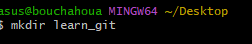
Cd (change directory) into the learn_git folder
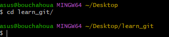
Create a file called third.txt
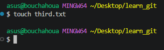
Initialize an empty git repository.
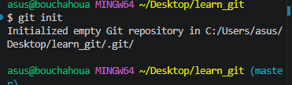
Add third.txt to the staging area.
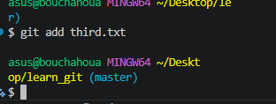
Commit with the message "adding third.txt".
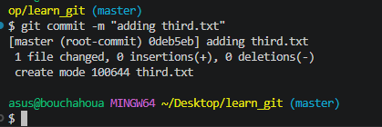
Check out your commit with git log.
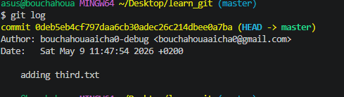
Create another file called fourth.txt.
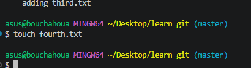
Add fourth.txt to the staging area.
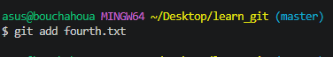
Commit with the message "adding fourth.txt"
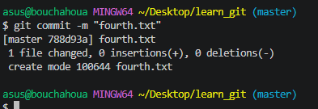
Remove the third.txt file
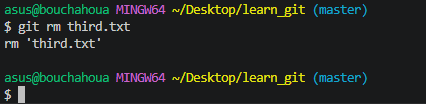
Add this change to the staging area. (Using the command "git add . "
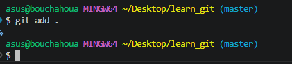
Commit with the message "removing third.txt"
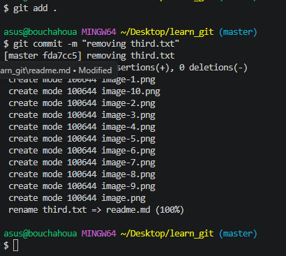